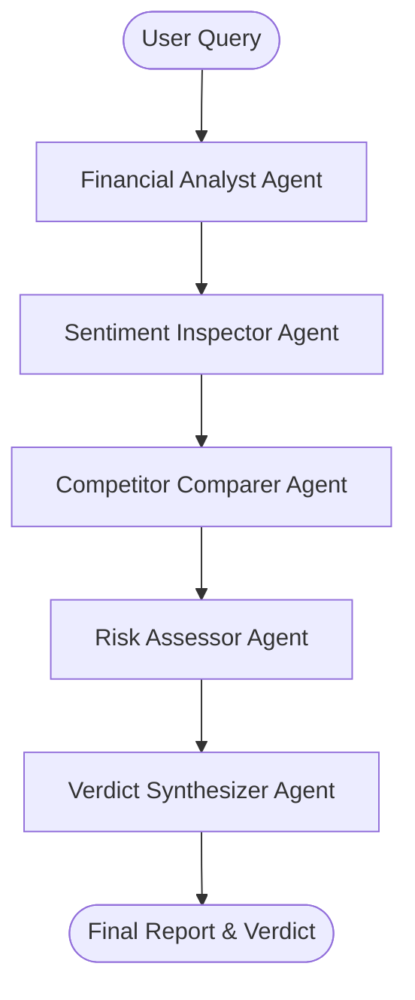

# 🎯 BullseyeAI — AI Investment Research Agent

**BullseyeAI** is a state-of-the-art AI-powered Investment Research Agent. It takes a company name or stock ticker, conducts thorough, multi-agent financial research, analyzes market sentiment, benchmarks competitors, parses potential risks, and synthesizes a structured "INVEST" or "PASS" verdict.

This project was built for the **InsideIIM × Altuni AI Labs** Take-Home Assignment.

---

## 🚀 Overview
BullseyeAI replaces manual, tedious financial research with a collaborative network of specialized AI agents. The user is presented with a **vibrant, joyful, and interactive glassmorphic dashboard** that visualizes the agent's real-time thought process, shows financial health charts, and provides a chatbot interface for follow-up questions.

### Key Features:
*   🤖 **Stateful Multi-Agent Workflow**: Managed by LangGraph.js to coordinate analysis between Financial, Sentiment, Competitor, and Synthesizer agents.
*   📊 **Real-time Thought Stream**: Dynamic terminal logging and node highlights representing what the agent is researching *right now*.
*   📈 **Competitor Benchmarking**: Rich interactive charting displaying key valuation ratios (P/E, PEG, Profit Margins) compared to industry peers.
*   💬 **Post-Analysis Chat**: Interact directly with the synthesized report to ask follow-up questions or test hypotheses.
*   🗂️ **SWOT & Risk Matrix**: Beautiful flip-cards organizing Strengths, Weaknesses, Opportunities, and Threats.
*   📥 **Memo Download Utility**: Export your completed investment research memo as a clean Markdown (`.md`) file directly from the dashboard.

---

## 🛠️ How to Run It

### 1. Prerequisites
Ensure you have **Node.js (v18.x or later)** and **NPM** installed.

### 2. Installation
Clone the repository (or extract the zip) and run:
```bash
cd bullseye-ai
npm install
```

### 3. Environment Configuration
Create a `.env.local` file in the root of the `bullseye-ai` folder and add your API keys:
```env
# The API key for Google Gemini (Required for LLM features)
GEMINI_API_KEY=your_gemini_api_key_here
```
*(Alternatively, you can paste your API key directly inside the **Developer Settings** panel in the web UI; it will save securely in your browser's local storage).*

### 4. Development Server
Run the local dev server:
```bash
npm run dev
```
Open [http://localhost:3000](http://localhost:3000) (or the port outputted in the console) in your browser.

---

## 🧠 How It Works (Architecture)

BullseyeAI uses a stateful Graph built on **LangGraph.js** to coordinate specialized agents:



1.  **State Schema**: An annotated state object (`AgentState`) tracking target ticker, core financial ratios, news sentiment summaries, competitor benchmark metrics, SWOT vectors, and reasoning.
2.  **Financial Agent**: Uses `yahoo-finance2` to scrape live multiples (P/E, margins, market cap). If lookup fails, invokes LLM estimations.
3.  **Sentiment Agent**: Extracts news headlines and aggregates public mood, translating media feeds into sentiment indexes (0-100).
4.  **Competitor Agent**: Calls LLM to identify top public peers, scrapes competitor statistics from Yahoo Finance, and computes relative benchmarking rankings.
5.  **Risk Agent**: Synthesizes SWOT quadrants and evaluates regulatory, macroeconomic, and supply risks.
6.  **Synthesizer Agent**: Aggregates the state findings and outputs the final verdict, conviction confidence percentage, and memo summary.

---

## ⚖️ Key Decisions & Trade-offs

1.  **Framework Choice (Next.js App Router)**:
    *   *Decision*: Combined React and Node.js in a single full-stack Next.js project instead of separate frontend and backend repositories.
    *   *Trade-off*: Reduces deployment overhead on Vercel and guarantees API routing syncs natively with frontend code.
2.  **SSE Streaming Client (POST fetch Reader)**:
    *   *Decision*: Avoided standard `EventSource` (SSE) library calls since it only supports GET requests and lacks request header/body controls. Instead, implemented a custom `ReadableStream` reader over a standard `fetch` POST.
    *   *Trade-off*: Allows secure passing of parameters (tickers, user-entered settings keys) in the POST request body instead of querying them via URL parameters.
3.  **Data Sourcing (Free Yahoo Finance API Scraper)**:
    *   *Decision*: Leveraged the free `yahoo-finance2` library instead of paid API keys (Alpha Vantage, SEC EDGAR, Bloomberg). 
    *   *Trade-off*: Avoids paid credit limitations and complex key registrations. To protect against throttle blocks, added robust LLM fallback generators.
4.  **Visual Graphing (Custom CSS & SVG meters)**:
    *   *Decision*: Opted for custom SVG radial gauges and CSS flex-meters instead of bulky charting libraries (e.g. Recharts, Chart.js) for competitor comparisons.
    *   *Trade-off*: Eliminates Next.js React Hydration Mismatch warnings, improves page load performance, and supports full CSS micro-animations.

---

## 📝 Example Runs

Here is an example output generated by the agent during a live run:

### NVIDIA Corporation (NVDA)
*   **Verdict**: `INVEST`
*   **Confidence Score**: `92%`
*   **Summary**: *"NVIDIA owns the compute stack for the artificial intelligence revolution. Their CUDA software ecosystem creates an impenetrable moat. Despite trading at a massive valuation, their explosive revenue growth and 50%+ net margins justify a buy."*
*   **Key Metrics**: P/E: `55.4x`, PEG: `1.1x`, Profit Margin: `54.8%`, Debt-to-Equity: `0.17`.
*   **Core Strength**: *"Absolute monopoly (85%+) in high-end data center AI GPUs."*
*   **Core Weakness**: *"High customer concentration (Big Tech hyperscalers = 40% of sales)."*

---

## 🔮 What We Would Improve with More Time

1.  **PDF Document RAG**: Parse official 10-K and 10-Q filing documents using vector database indexing for granular accounting notes.
2.  **Technical Analysis Node**: Integrate chart patterns (RSI, MACD, Simple Moving Averages) alongside fundamental analysis.
3.  **Portfolio Optimization**: Allow users to run comparative analyses on up to 5 stocks at once and generate model portfolio allocations.
4.  **Interactive Timeline Chart**: Render stock historical lines over 5-year intervals with key agent annotations marking historic news events.
